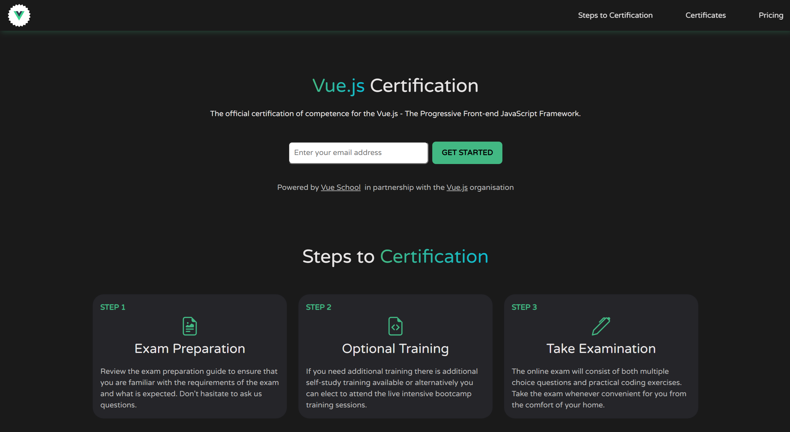
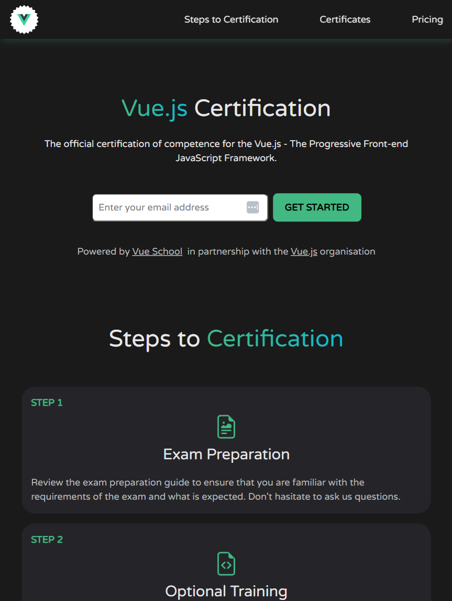
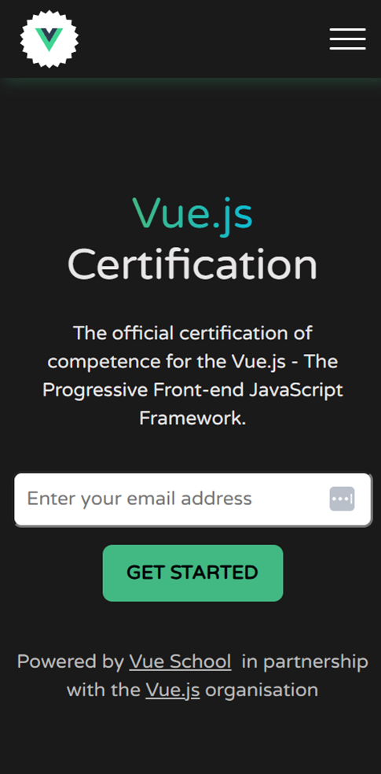
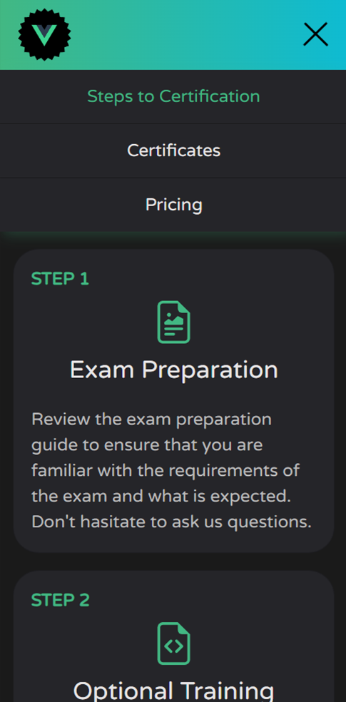
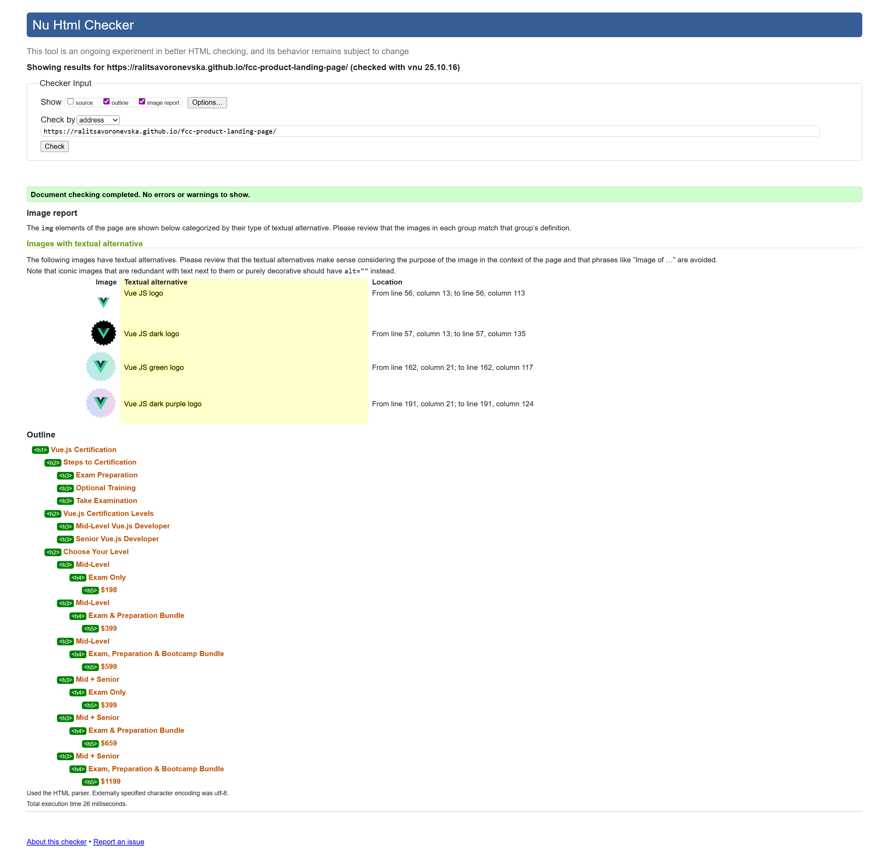
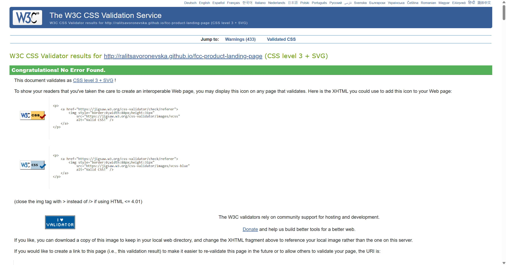
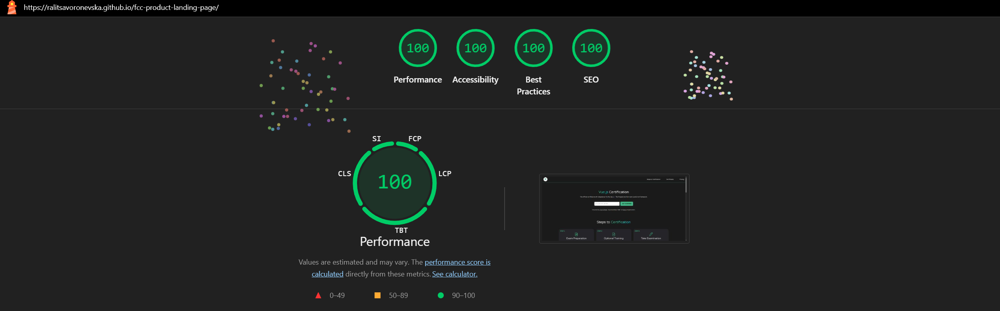
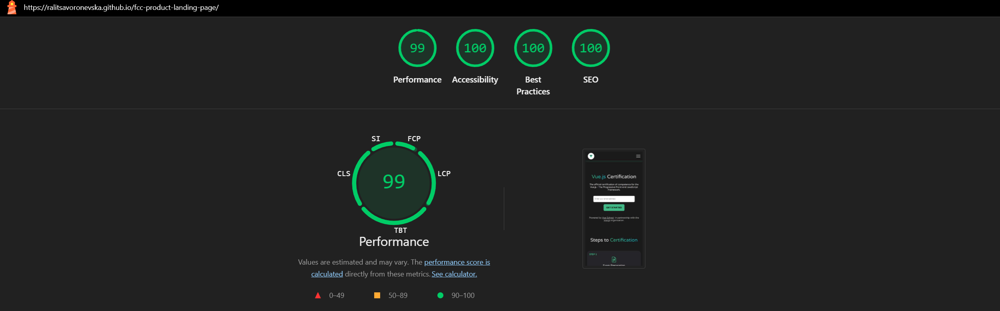
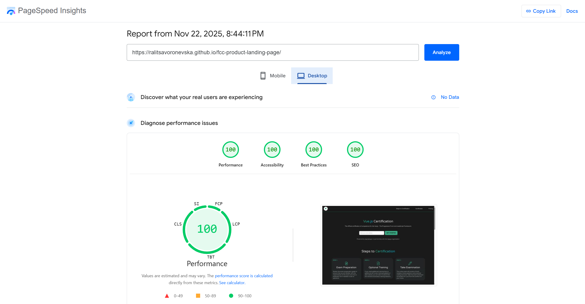
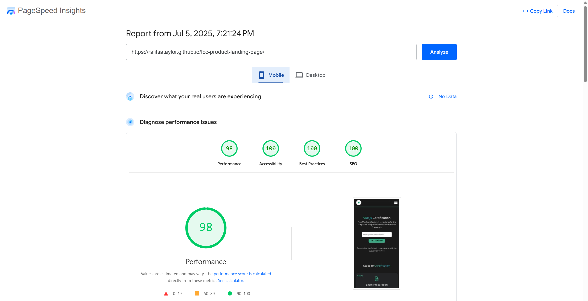

# 🚀 FCC: Build a Product Landing Page

📝 [CodePen](https://codepen.io/ralitsavoronevska/pen/GgJKYWp/)
🔗[Live GitHub Preview](https://ralitsavoronevska.github.io/fcc-product-landing-page/)

🎯 FreeCodeCamp Requirements

 

Responsive Web Design Projects - Build a Product Landing Page

Objective: Build an app that is functionally similar to https://codepen.io/freeCodeCamp/pen/RKRbwL. Do not copy this demo project.

Fulfill the below user stories and get all of the tests to pass. Give it your own personal style.

> You can use HTML, JavaScript, and CSS to complete this project. Plain CSS is recommended because that is what the lessons have covered so far and you should get some practice with plain CSS. You can use Bootstrap or SASS if you choose. Additional technologies (just for example jQuery, React, Angular, or Vue) are not recommended for this project, and using them is at your own risk. Other projects will give you a chance to work with different technology stacks like React. We will accept and try to fix all issue reports that use the suggested technology stack for this project. Happy coding!

✅ User Story #1: Your product landing page should have a header element with a corresponding id="header".                                                 
🖼️ User Story #2: You can see an image within the header element with a corresponding id="header-img" (A logo would make a good image here).             
🧭 User Story #3: Within the #header element, you can see a nav element with a corresponding id="nav-bar".                                                
🔗 User Story #4: You can see at least three clickable elements inside the nav element, each with the class nav-link.                                     
🏃‍♂️ User Story #5: When you click a .nav-link button in the nav element, you are taken to the corresponding section of the landing page.                
🎬 User Story #6: You can watch an embedded product video with id="video".                                                                                
📝 User Story #7: Your landing page has a form element with a corresponding id="form".                                                                    
✉️ User Story #8: Within the form, there is an input field with id="email" where you can enter an email address.                                          
💬 User Story #9: The #email input field should have placeholder text to let users know what the field is for.                                            
✅ User Story #10: The #email input field uses HTML5 validation to confirm that the entered text is an email address.                                      
📤 User Story #11: Within the form, there is a submit input with a corresponding id="submit".                                                             
📧 User Story #12: When you click the #submit element, the email is submitted to a static page (use this mock URL: https://www.freecodecamp.com/email-submit).                                                                                                                                            
📌 User Story #13: The navbar should always be at the top of the viewport.                                                                                
📱 User Story #14: Your product landing page should have at least one media query.                                                                        
🧩 User Story #15: Your product landing page should utilize CSS flexbox at least once.                                                                    

You can build your project by forking this [CodePen pen](https://codepen.io/freeCodeCamp/pen/MJjpwO/).
Or you can use this CDN link to run the tests in any environment you like:
https://cdn.freecodecamp.org/testable-projects-fcc/v1/bundle.js.
Once you're done, submit the URL to your working project with all its tests passing.
Remember to use the [Read-Search-Ask](https://www.freecodecamp.org/forum/t/how-to-get-help-when-you-are-stuck/19514/) method if you get stuck.

📸 Screenshots

## 🖥️ Desktop preview:

## 📱 Tablet preview:

<table>
  <tr>
    <td colspan="2">📱 Mobile Preview:</td>
  </tr>
  <tr>
    <td></td>
    <td></td>
  </tr>
</table>

 

# 🏅 W3C HTML Validator

 

# 🏅 W3C CSS Validator

 

# 🌈 Chrome LightHouse Audit

Desktop:

 

Mobile:

 

# ⚡ PageSpeed Insights Results

Desktop:

 

Mobile:

  
        
  

# 🛠️ Built with:

                                                                         
          
🔨 SCSS Files [Fully Responsive, Mobile First Approach, Transitions & Flex Layout]           
⛏️ [Google Font: Varela Round](https://fonts.google.com/specimen/Varela+Round/)                                                                  
🪓 [Bootstrap v5.3](https://getbootstrap.com/docs/5.3/getting-started/introduction/)                                                             
🪛 [Bootstrap v5.3 Icons](https://icons.getbootstrap.com/)                                                                                       
🔩 [Bootstrap v5.3 Card](https://getbootstrap.com/docs/5.3/components/card/)  

# ✨ Features:
✅ Slick sticky navigation with smooth scroll to the Product Landing Page's 3 sections                                                            
✅ Engaging Hero Section with links and Stylish HTML5 Email validation + Regex                                                                    
✅ Elegant Bootstrap Cards with icons to showcase the Features and Pricing                                                                       
✅ Embedded Product Preview Video with Responsive Image Poster                                                                                   
✅ Custom-styled footer with useful links                                                                                                         
✅ manifest.json                                                                                                                                  

# 🧰 Online tools:
                                            
🪄 [svg-to-png & svg minification](https://www.svgviewer.dev/svg-to-png/)       
🖼️ [Photopea [Online Photo Editor]](https://www.photopea.com/)                                                                                  
⭐ [jpg-to-webp free converter](https://www.freeconvert.com/jpg-to-webp/)   
💫 [free image compressor](https://compress-or-die.com/webp/)                                                                                     

# 🌐 Browser Support:
(Last updated and tested: 14/12/2025)                                                                                                                 
🌟 Chrome 143.0.7499.110 (64-bit)                                                                                                                      
🦊 Firefox 146.0 (64-bit)                                                                                                                           
🏴‍☠️ Opera 125.0.5729.21 (64-bit)                                                                                                                   
🪟 Edge 143.0.3650.80 (64-bit)                                                                                                                        

# 🧪 Online Validators:
✔️ [W3C HTML Validator](https://validator.w3.org/)                                                                                               
✔️ [W3C CSS Validator](https://jigsaw.w3.org/css-validator/)                                                                                     
💡 [LightHouse Audit](https://developers.google.com/web/tools/lighthouse/)                                                                       
⚡ [PageSpeed Insights Audit](https://pagespeed.web.dev/)                                                                                    
⭐ [WebPageTest](https://www.webpagetest.org/)                                                                                                    

# 🌟 Inspiration & Credits:
🖼️ https://certificates.dev/vuejs                                                                                                               
📝 https://codepen.io/bato-web-agency/pen/OPJQppX                                                                                                
:octocat: https://github.com/pricing                                                                                                             
⭐ https://getbootstrap.com/docs/5.3/examples/heroes                                                                                              
⭐ https://getbootstrap.com/docs/5.3/examples/pricing     
✅ https://pagespeedchecklist.com/responsive-embedded-videos                                                                                      

---
  
🙌 Thank you for checking out my project! More is coming 🔜.                                                                                           
Stay tuned 🚀 and please don't forget to give the project a star! ⭐                                                                                     
Made with lots of 💗, ☕, and a sprinkle of ✨ by Ralitsa Voronevska!                                                                                
